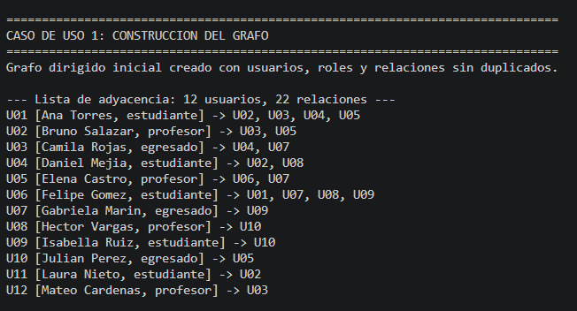
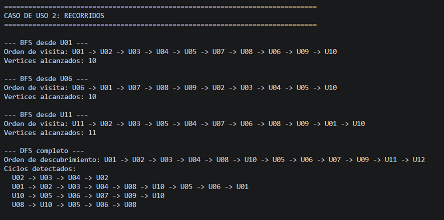
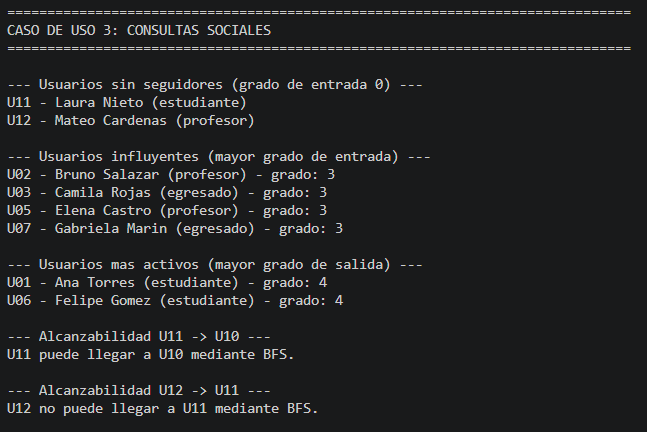
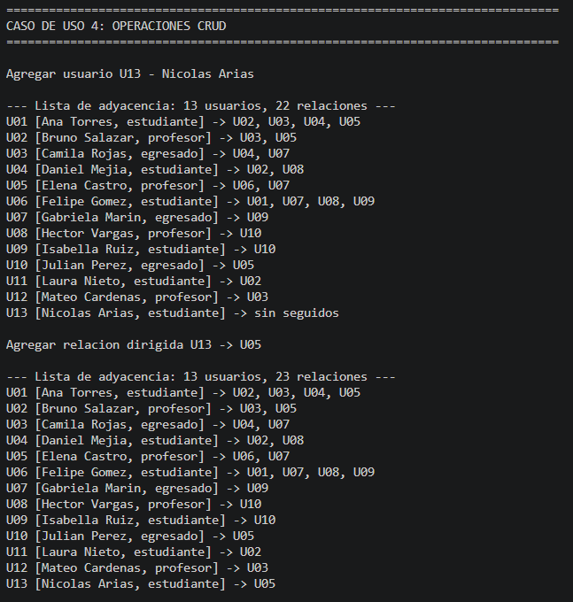
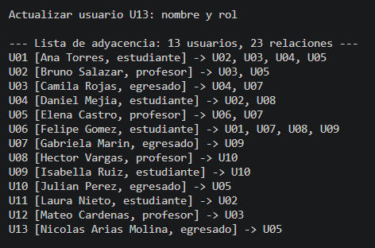
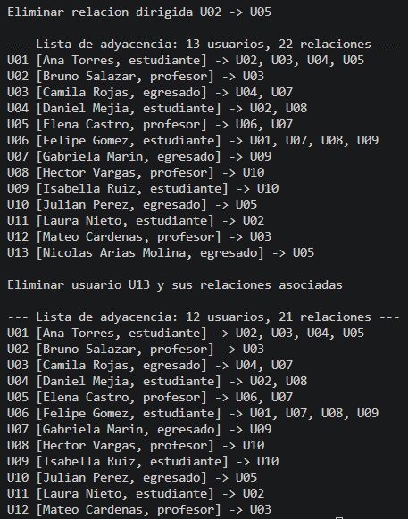

# CAMPUSNET - TALLER INTEGRADOR: GRAFOS DIRIGIDOS MVC

## Descripción General del Proyecto

CampusNet es una aplicación de consola desarrollada en C# que simula una red social básica utilizando grafos dirigidos. El proyecto implementa el patrón de diseño Modelo-Vista-Controlador (MVC) para gestionar usuarios, relaciones de seguimiento y consultas sociales. La aplicación construye un grafo inicial con usuarios de diferentes roles (estudiantes, profesores, egresados), realiza recorridos (BFS y DFS), ejecuta consultas sociales y demuestra operaciones CRUD sobre el grafo.

## Integrante
Juan Jose Pareja Ruiz

## Roles o Responsabilidades Específicas
- Desarrollador principal: Diseño e implementación del modelo de grafo dirigido, controlador MVC y vista de consola.
- Responsable de la lógica de algoritmos de recorridos (BFS/DFS) y detección de ciclos.
- Implementación de operaciones CRUD para vértices y aristas.
- Desarrollo de consultas sociales basadas en grados de entrada y salida.

## Requisitos para Ejecutar
- **Entorno de Desarrollo**: Visual Studio Code versión 1.119.0 o superior.
- **SDK de .NET**: Versión 10.0.203 o superior (desarrollado con .NET 10.0).
- Sistema operativo compatible con .NET (Windows, Linux, macOS).
- Terminal o consola para ejecutar comandos.

## Instrucciones de Uso

### Ejecución
1. Clona el repositorio o descarga el proyecto desde GitHub.
2. Abre una terminal y ve a la carpeta raíz del proyecto.
3. Compila el proyecto:
   ```
   dotnet build
   ```
4. Ejecuta el proyecto:
   ```
   dotnet run
   ```

## Estructura del Proyecto
```
CampusNet/
│
├── Controlador/        # Carpeta del controlador MVC que orquesta las operaciones
│
├── Images/             # Carpeta de capturas de pantalla que documentan la ejecución
│
├── Modelo/             # Carpeta con el grafo dirigido y las clases de dominio
│
├── Vista/              # Carpeta de la vista de consola que muestra resultados
│
├── .gitignore          # Reglas de exclusión de archivos para Git
├── CampusNet.csproj    # Proyecto .NET que compila la aplicación
├── CampusNet.sln       # Solución que agrupa el proyecto y sus dependencias
├── Program.cs          # Clase principal que inicia la ejecución de la app
└── Readme.md           # Documentación del proyecto
```

## Contenido de Cada Carpeta
- **Controlador/**: Contiene `CampusNetController.cs`, que maneja la lógica de negocio, coordina entre modelo y vista, y define los casos de uso (construcción del grafo, recorridos, consultas, CRUD).
- **Modelo/**: Implementa las clases del dominio:
  - `Graph.cs`: Grafo dirigido con métodos para agregar/eliminar/actualizar vértices y aristas, recorridos BFS/DFS, consultas de grados y alcanzabilidad.
  - `Vertex.cs`: Representa un usuario con ID, nombre y rol (estudiante, profesor, egresado).
  - `Edge.cs`: Representa una relación dirigida de seguimiento entre dos usuarios.
- **Vista/**: Contiene `ConsoleView.cs`, responsable de imprimir encabezados, resultados de recorridos, consultas y operaciones en la consola.
- **Images/**: Almacena capturas de pantalla que demuestran la ejecución de la aplicación en diferentes etapas.

## Decisiones de Diseño Relevantes
- **Patrón MVC**: Separación clara entre modelo (lógica de datos), vista (presentación) y controlador (lógica de aplicación) para mantener el código modular y testable.
- **Grafo Dirigido**: Elegido para representar relaciones asimétricas de seguimiento en una red social, donde A seguir a B no implica que B siga a A.
- **Validaciones**: Implementadas en constructores y métodos para asegurar integridad de datos (IDs únicos, roles válidos, no auto-relaciones).
- **Recorridos Eficientes**: BFS para alcanzabilidad y orden de visita; DFS para detección de ciclos y orden de descubrimiento.
- **Consultas Sociales**: Basadas en grados (entrada para influencia, salida para actividad) y alcanzabilidad.
- **Operaciones CRUD**: Completas para vértices y aristas, con eliminación en cascada para mantener consistencia.
- **Vista de Consola**: Simple y directa para demostrar funcionalidad sin dependencias externas.

## Flujo de Ejecución
1. **Inicialización**: Se crea una instancia del controlador con un grafo vacío y vista de consola.
2. **Construcción del Grafo**: Se agregan 12 usuarios iniciales con roles y se establecen relaciones de seguimiento sin duplicados.
3. **Recorridos**: Se ejecutan BFS desde nodos específicos y DFS completo para detectar ciclos.
4. **Consultas Sociales**: Se identifican usuarios sin seguidores, influyentes (alto grado entrada) y activos (alto grado salida), y se verifica alcanzabilidad entre pares.
5. **Operaciones CRUD**: Se demuestra agregar usuario y relación, actualizar usuario, eliminar relación y usuario (con eliminación de aristas asociadas).
6. **Salida**: Resultados se imprimen en consola tras cada operación.

## Flujo de Ejecucion Automatica 
La aplicación es completamente automática y no requiere interacción del usuario. Al ejecutar `dotnet run`, se procesan todos los casos de uso secuencialmente:
- Construye el grafo inicial.
- Realiza recorridos y consultas.
- Ejecuta operaciones CRUD.
- Muestra resultados en la consola.


## Notas Técnicas
- **Lenguaje**: C# 12 con .NET 10.0.
- **Algoritmos**: BFS (cola) y DFS (recursivo con detección de ciclos) para recorridos.
- **Estructuras de Datos**: Diccionarios para vértices y lista de adyacencia para aristas, optimizando búsquedas y recorridos.
- **Complejidad**: BFS/DFS O(V + E), consultas de grados O(V + E), operaciones CRUD O(1) promedio para vértices, O(grado) para aristas.
- **Manejo de Errores**: Excepciones para validaciones, retornos booleanos para operaciones fallidas.
- **Normalización**: IDs insensibles a mayúsculas/minúsculas para robustez.
- **Inmutabilidad**: Propiedades de solo lectura donde apropiado, métodos de actualización controlados.

## Evidencia de Ejecución
Las siguientes capturas de pantalla muestran la ejecución exitosa de la aplicación:

- ## Construcción_del_Grafo
  

- ## Recorridos
  

- ## Consultas_Sociales
  

- ## Operaciones_CRUD_Agregar
  

- ## Operaciones_CRUD_Actualizar
  

- ## Operaciones_CRUD_Eliminar
  

Las imágenes se encuentran en la carpeta `Images` y pueden visualizarse directamente en el repositorio.

---

### CAMPUSNET - TALLER INTEGRADOR: GRAFOS DIRIGIDOS MVC